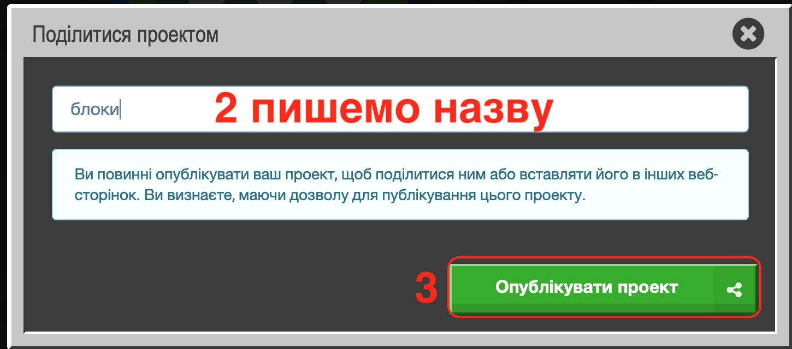
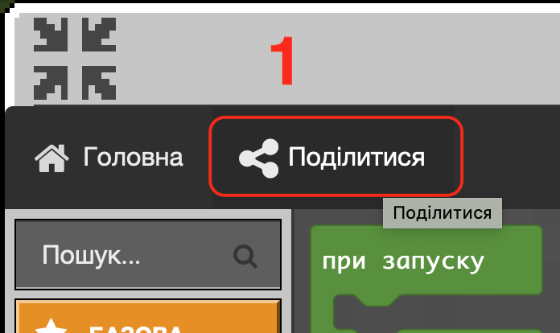
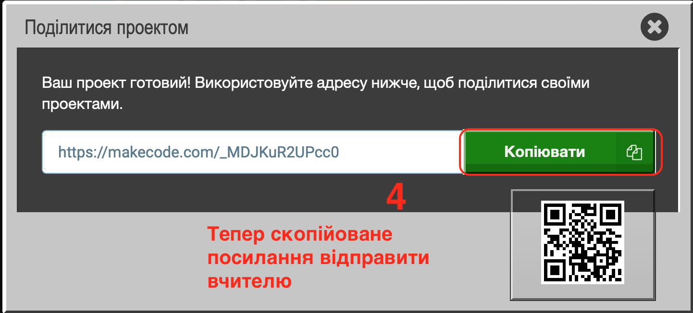

# Перші кроки в Minecraft Education

**Опис**:


Сьогодні ми познайомимося один з одним і викладачем. Ознайомимося із сервером, елементами керування гравця, інструментами керування агента. Навчимо агента створювати лінію та прямокутники.&#x20;


## **Сьогодні ми:**

1. Познайомимось один з одним задля комфортної співпраці.&#x20;
2. Ознайомимось із сервером, елементами управління гравця, інструментами управління агента.
3. Навчимось створювати лінію квітів та змінювати елементи у лінії квітів.
4. Навчимось самостійно збільшувати кількість елементів у лінії квітів.
5. Створимо комбінацію квітів та поворотів.
6. Навчимось створювати та змінювати лінію блоків.
7. Здобудемо необхідні знання для подальшого розвитку в Minecraft Education!

## **Особливості Minecraft, які поки не владнала компанія Microsoft**


1. ❗️При програмуванні у побудовнику коду можуть зникати проєкти — назавджи. Без причини. Тому окремо можна їх **публікувати і зберігати** у текстовому документі чи у Viber («Мої нотатки») або відправляти все у Schoolodgy.
2. ❗️Приєднати на спільному сервері можна лише **50% учасників** (бо залежить від багатьох факторів — операційна система, версія програми, інтернет, інші запущені програми)
3. ❗️Створені світи видно **лише в одному акаунту**. Якщо зайти на тому самому комп'ютері в інший акаунт — світів не видно, але видно коди.&#x20;
4. ❗️Якщо ввійти у той самий акаунт з іншого пристрою — не буде ні коду, ні створених світів.&#x20;
5. ❗️У версії 18.32… почалися проблеми із координатами.


## **Якщо ви пропустили заняття**&#x20;

Є **відеозапис** та **домашнє завдання** у [**Schoolodgy**](https://app.schoology.com/)



Або можна повторити

[**Інструкція до реєстрації у Schoology**](https://youtu.be/l98zdCJGcPY)

## Для початку давайте познайомимося з проектами, які ви теж зможете зробити після нашого курсу🌟

### 1. Місто для життя

Проект, створений нашим студентом Данилой Остапчук


Ідея: побудувати невелике місто, для життя і відпочинку туристів.&#x20;

В місті є різні споруди: будинки, готель, магазин, вілли і фонтан. Студент намагався автоматизувати процес та не здійснювати будівництво споруд вручну.

Для цього він написав кілька функцій для побудови будинків та фонтану, використовуючи знання та навички, здобуті на навчаннях по технічних скілах.

Основне завдання його функцій — встановити блоки різних типів в координатах, які він розрахував.


<figure><figcaption>
Виконав: Данило Остапчук
</figcaption></figure>

#### Детальніше познайомитися з проектом можна[ тут](https://www.new.goiteens.club/projects/minecraft/) або [тут](https://drive.google.com/drive/folders/1UXrgOdQFCsa1gxviFmMcG9EjPyk06Qnj)

### 2. Зоопарк

Проект, створений нашим студентом Максимом Павленко (10 років)


Ідея полягала в тому, що зоопарк повинен бути незвичним, тому студент побудував його у пустелі на скелі. Перед будинком побудовано фонтан. Далі йде сам зоопарк, а після нього — невеликий сад. Дах будинку зроблено з полублоків.

Для того, щоб зробити цей проект, було використано наступні знання: побудова з використанням координатів, використання функцій, функції позиції.


<figure><figcaption>
Виконав: Максим Павленко
</figcaption></figure>

#### Детальніше познайомитися з проектом можна [тут](https://drive.google.com/drive/folders/1h7V1V7j72TqYhCohQF\_JxgoQaWu1ghDD)

Проект, створений нашим студентом Тарасом Максименко (9 років)


Зоопарк вміщує шість кліток з тваринами, а саме: з пандами та з лисицями, з ведмедями та з грибними коровами, а також є клітки з бджолами та з вовками. Між клітками прокладені доріжки, також лавки для перепочинку і ліхтарі для освітлення уночі. Поряд з зоопарком є будинок доглядача тварин та ветеринара.


<figure><figcaption>
Виконав: Тарас Максименко
</figcaption></figure>

#### Детальніше познайомитися з проектом можна [тут](https://docs.google.com/presentation/d/1H9Z8N7R506\_CxPgxxlw-E4YNPtZ2R4tTARvOikPojY4/edit#slide=id.g75a63b5aab\_0\_0)

## Основні завдання

<table data-header-hidden><thead><tr><th width="150"></th><th width="357"></th><th width="362"></th></tr></thead><tbody><tr><td><strong>Назва</strong></td><td><strong>Лінія квітів</strong></td><td><strong>Лінія блоків</strong></td></tr><tr><td><strong>Завдання</strong></td><td>– 6 маків – 10 бамбуків – 4 саджанці дуба – 7 блакитних волошок – 3 папоротники</td><td>– 6 блоків скла – 10 блоків вибухівки – 4 блоки гарбуза – 7 блоків білого бетону – 3 блоки з цегли</td></tr><tr><td><strong>Код</strong></td><td></td><td> </td></tr><tr><td><strong>Результат</strong></td><td></td><td></td></tr></tbody></table>

### Прапор України

<table data-header-hidden><thead><tr><th width="286"></th><th></th></tr></thead><tbody><tr><td>Завдання:</td><td>Використовуючи агента, побудувати блоки у вигляді прапору України з синього та жовтого кольору</td></tr><tr><td>Результат:</td><td></td></tr><tr><td>Код:</td><td></td></tr></tbody></table>

Посилання на код: [https://makecode.com/\_WqdA5v10u5dj](https://makecode.com/\_WqdA5v10u5dj)

## Самостійно

Написати код за алгоритмом:&#x20;

1. Потрібно Агента **телепортувати** до Гравця&#x20;
2. Агент робить **3 кроки вперед**&#x20;
3. Агент ставить **один блок Редстоуна**, а на нього згори ставить один блок Лампи з редстоуна

<figure><figcaption>
Підсумки заняття
</figcaption></figure>

## **Як завантажити свій код**

<table data-header-hidden><thead><tr><th width="339"></th><th width="315"></th></tr></thead><tbody><tr><td>1. Поділитися</td><td></td></tr><tr><td>
2. Пишемо назву для коду проєкту

3. Публікуємо в інтернеті
</td><td></td></tr><tr><td>4. Копіюємо посилання  Скопійоване посилання потрібно вставити в ДЗ як текстовий рядок</td><td></td></tr></tbody></table>

## **Додати свій код у ДЗ**


На наступному занятті на вас чекає ще більше інструментів у Minecraft!

