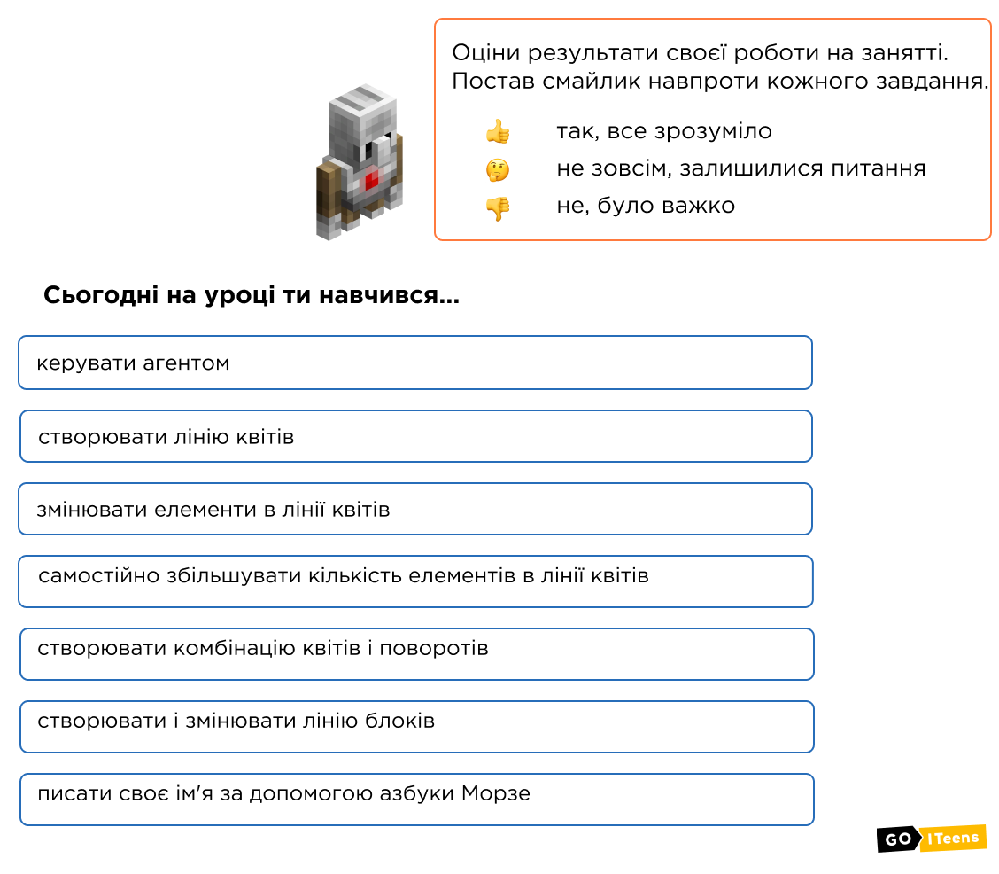

# Перші кроки в Minecraft Education

**Опис**:


Сьогодні ми познайомимося один з одним і викладачем. Ознайомимося із сервером, елементами керування гравця, інструментами керування агента. Навчимо агента створювати лінію та прямокутники.&#x20;


## **Сьогодні ми:**

1. Познайомимось один з одним задля комфортної співпраці.&#x20;
2. Ознайомимось із сервером, елементами управління гравця, інструментами управління агента.
3. Навчимось створювати лінію квітів та змінювати елементи у лінії квітів.
4. Навчимось самостійно збільшувати кількість елементів у лінії квітів.
5. Створимо комбінацію квітів та поворотів.
6. Навчимось створювати та змінювати лінію блоків.
7. Здобудемо необхідні знання для подальшого розвитку в Minecraft Education!

## **Особливості Minecraft, які поки не владнала компанія Microsoft**


1. ❗️При програмуванні у побудовнику коду можуть зникати проєкти — назавджи. Без причини. Тому окремо можна їх **публікувати і зберігати** у текстовому документі чи у Viber («Мої нотатки») або відправляти все у Schoolodgy.
2. ❗️Приєднати на спільному сервері можна лише **50% учасників** (бо залежить від багатьох факторів — операційна система, версія програми, інтернет, інші запущені програми)
3. ❗️Створені світи видно **лише в одному акаунту**. Якщо зайти на тому самому комп'ютері в інший акаунт — світів не видно, але видно коди.&#x20;
4. ❗️Якщо ввійти у той самий акаунт з іншого пристрою — не буде ні коду, ні створених світів.&#x20;
5. ❗️У версії 18.32… почалися проблеми із координатами.


## **Якщо ви пропустили заняття**&#x20;

Є **відеозапис** та **домашнє завдання** у **** [**Schoolodgy**](https://app.schoology.com/)****



Або можна повторити

****[**Інструкція до реєстрації у Schoology**](https://youtu.be/l98zdCJGcPY)****

## Основні завдання

| **Назва**     | **Лінія квітів**                                                                                   | **Лінія блоків**                                                                                                      |
| ------------- | -------------------------------------------------------------------------------------------------- | --------------------------------------------------------------------------------------------------------------------- |
| **Завдання**  | 
– 6 маків – 10 бамбуків – 4 саджанці дуба – 7 блакитних волошок – 3 папоротники
 | 
– 6 блоків скла – 10 блоків вибухівки – 4 блоки гарбуза – 7 блоків білого бетону – 3 блоки з цегли
 |
| **Код**       | .png>)                                                               |  .png>)                                                                                |
| **Результат** | .png>)                                                               | .png>)                                                                                 |

### Прапор України

|            |                                                                                                |
| ---------- | ---------------------------------------------------------------------------------------------- |
| Завдання:  | Використовуючи агента, побудувати блоки у вигляді прапору України з синього та жовтого кольору |
| Результат: |                                                                      |
| Код:       |                               |

Посилання на код: [https://makecode.com/\_WqdA5v10u5dj](https://makecode.com/\_WqdA5v10u5dj)


Якщо ви впорались з усіма основними завданнями, перейдіть до додаткового. Його виконання дозволить вам вдосконалити набуті навички!


## Додаткове завдання

Напишіть за допомогою азбуки Морзе своє ім'я.


**Азбука Мо́рзе** — спосіб знакового кодування, представлення букв алфавіту, цифр, розділових знаків та інших символів послідовністю сигналів: довгих (тире) і коротких (точок). Була винайдена американцем Семюелем Фінлі Бриз **Морзе** у 1838 році.


| **Код Морзе англійською** | .png>) |
| ------------------------- | ------------------------------------- |
| **Код Морзе українською** | .png>)  |
| **Код Морзе російською**  |         |

### Пишемо КIТ азбукою Морзе

|      |
| ----------------------------------------------------------------------------------------------------------------------------------------------------------------------------------------------------------------------------------------- |
|       |
|  |
|       |
|       |

<figure><figcaption></figcaption></figure>

|     К     |    I   |    Т   |
| :-------: | :----: | :----: |
| **\_.\_** | **..** | **\_** |

       ****               

### **Або через меню**

**Запускаємо КІТ**

## **Додаткове завдання**

Напиши за допомогою азбуки Морзе своє ім'я.

## Більш складний варіант

### Команди чата

| **Крапка**                           | .png>) |
| ------------------------------------ | ------------------------------------- |
| **Тире**                             | .png>) |
| **Пробіл**                           | .png>) |
| **Написання літер командами в чаті** | .png>) |

### Функції

### Тире

| **1) Створюємо функцію** | .png>) |
| ------------------------ | ------------------------------------- |
| **2) Даємо назву**       | .png>)  |
| **3) Задаємо код**       | .png>) |

### Крапка

| **1) Створюємо функцію** | .png>)  |
| ------------------------ | ------------------------------------- |
| **2) Даємо назву**       | .png>) |
| **3) Задаємо код**       | .png>) |

### Пробіл

| **1) Створюємо функцію** | .png>) |
| ------------------------ | ------------------------------------- |
| **2) Даємо назву**       | .png>) |
| **3) Задаємо код**       | .png>) |

### Завдання і виконання команди

1\) Створюємо команду чату та переносимо до неї блоки виклику функцій.

.png>)

2\) Створюємо команду чату та переносимо до неї блоки виклику функцій.

.png>)

3\) Викликаємо створену програму (команда чату max).

.png>)

Готово, ви чудові!

## Самостійно

Написати код за алгоритмом:&#x20;

1. Потрібно Агента **телепортувати** до Гравця&#x20;
2. Агент робить **3 кроки вперед**&#x20;
3. Агент ставить **один блок Редстоуна**, а на нього згори ставить один блок Лампи з редстоуна

## **Як завантажити свій код**

| 1. Поділитися                                                                                       |        |
| --------------------------------------------------------------------------------------------------- | -------------------------------- |
| 
2. Пишемо назву для коду проєкту

3. Публікуємо в інтернеті
                      | .png>) |
| 
4. Копіюємо посилання  Скопійоване посилання потрібно вставити в ДЗ як текстовий рядок
 |        |

## **Додати свій код у ДЗ**

## **Домашнє завдання**

🏃‍♂️ Запрограмувати Агента, щоб він кодом зробив **заглибину у 4 блоки довжиною**&#x20;

🛣 Кодом зробити **дорогу** з килимів довжиною у **22 блоки**&#x20;

✅ Код опублікуйте в Schoolodgy як[ тут](https://youtu.be/KW4fCTlCnf8)

🏋️‍♀️ **Додатково (за бажанням)**: побудувати кодом квітник у формі квадрату **розміром 5\*5 квітів**


На наступному занятті на вас чекає ще більше інструментів у Minecraft!

